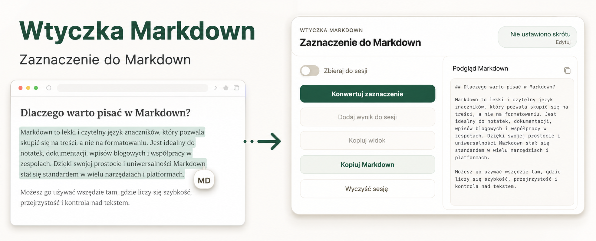
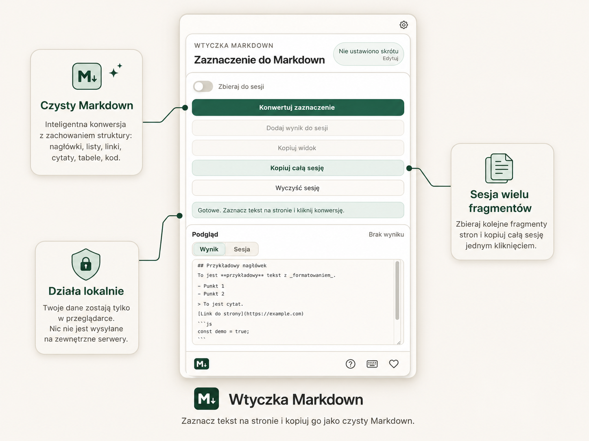

# Wtyczka Markdown



**Wtyczka Markdown** to rozszerzenie Chrome, które zamienia zaznaczony fragment strony internetowej na czysty Markdown i kopiuje wynik do schowka.

Przydaje się do szybkiego zbierania treści z artykułów, dokumentacji, opisów produktów, researchu SEO, notatek i pracy z narzędziami AI.

## Najważniejsze funkcje

- Konwersja zaznaczonego fragmentu strony do Markdown.
- Kopiowanie wyniku do schowka jednym kliknięciem.
- Zbieranie wielu fragmentów do jednej sesji Markdown.
- Kopiowanie całej sesji jednym przyciskiem.
- Pływający przycisk `MD` przy zaznaczeniu tekstu.
- Obsługa popupu, skrótu klawiszowego i menu kontekstowego.
- Możliwość edycji skrótu w ustawieniach Chrome.
- Czyszczenie reklam, popupów, widgetów i zbędnych elementów strony.
- Obsługa nagłówków, list, linków, cytatów, tabel i bloków kodu.
- Działanie lokalne, bez wysyłania treści na zewnętrzne serwery.

## Zastosowanie

Wtyczka sprawdzi się, gdy chcesz szybko skopiować treść strony jako Markdown do:

- notatek,
- dokumentacji,
- edytora Markdown,
- systemu CMS,
- narzędzi AI,
- researchu SEO i content marketingu,
- analizy treści konkurencji.

## Jak wygląda



## Jak używać

1. Zaznacz fragment tekstu na stronie.
2. Kliknij pływający przycisk `MD`, użyj popupu, skrótu klawiszowego albo menu kontekstowego.
3. Wklej skopiowany Markdown tam, gdzie chcesz.
4. Jeśli chcesz zebrać więcej fragmentów, włącz tryb **Zbieraj do sesji**.

## Instalacja w Chrome

Na ten moment wtyczka jest dostępna jako rozszerzenie ładowane ręcznie.

1. Pobierz albo sklonuj repozytorium.
2. Otwórz w Chrome: `chrome://extensions`
3. Włącz **Tryb dewelopera**.
4. Kliknij **Załaduj rozpakowane**.
5. Wybierz folder projektu.

Jeśli testujesz lokalny plik `test-page.html`, wejdź w szczegóły rozszerzenia i włącz dostęp do adresów `file://`.

## Prywatność

Wtyczka działa lokalnie w przeglądarce.

- Nie wysyła zaznaczonych treści na serwer.
- Nie korzysta z zewnętrznego API.
- Nie używa AI do przetwarzania treści.
- Sesja zbierania fragmentów jest zapisywana lokalnie w Chrome.
- Schowek jest używany tylko wtedy, gdy uruchomisz kopiowanie lub konwersję.

## Uprawnienia

Rozszerzenie używa następujących uprawnień Chrome:

- `activeTab` - dostęp do aktywnej karty po akcji użytkownika.
- `contextMenus` - menu kontekstowe po zaznaczeniu tekstu.
- `storage` - zapis ustawień i sesji.
- `clipboardWrite` - kopiowanie Markdown do schowka.
- `<all_urls>` - działanie na różnych stronach internetowych.

Uprawnienie `<all_urls>` jest zostawione w pierwszej wersji, żeby popup, skrót, menu kontekstowe i pływający przycisk działały spójnie na zwykłych stronach. Chrome nadal blokuje rozszerzenia na stronach systemowych, Chrome Web Store i części specjalnych widoków.

## Informacje techniczne

Wtyczka jest rozszerzeniem Chrome zgodnym z **Manifest V3**.

Projekt nie używa zewnętrznych zależności runtime do konwersji Markdown. Logika działa lokalnie w content scriptach i popupie rozszerzenia.

## Development

Wymagania:

- Node.js
- npm

Instalacja zależności:

```bash
npm install
```

Pełna weryfikacja:

```bash
npm run verify
```

Komenda sprawdza:

- poprawność manifestu i składni JavaScript,
- podstawowy lint runtime,
- testy automatyczne,
- podatności zależności przez `npm audit`.

## Status

Aktualna wersja: `0.1.1`

Projekt jest na etapie pierwszej wersji open source. Działa lokalnie jako rozszerzenie ładowane ręcznie w Chrome.

## License

MIT. Szczegóły w pliku `LICENSE`.
