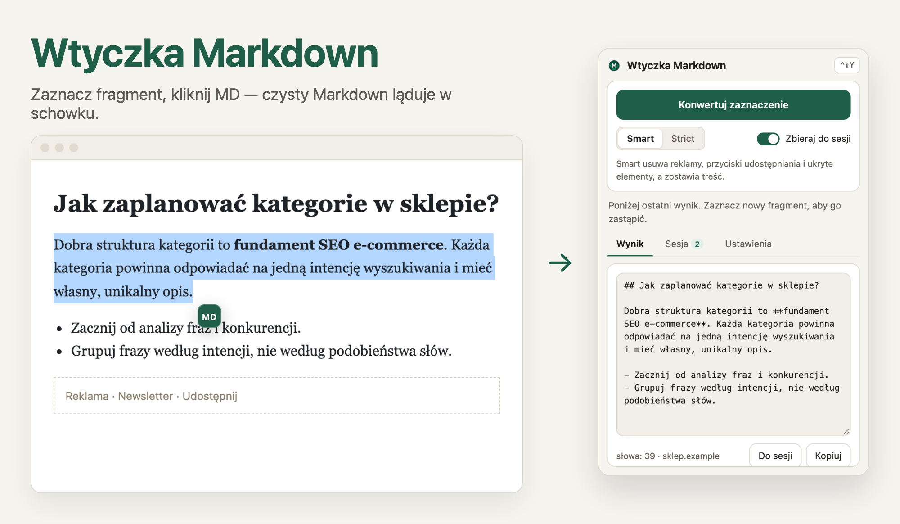
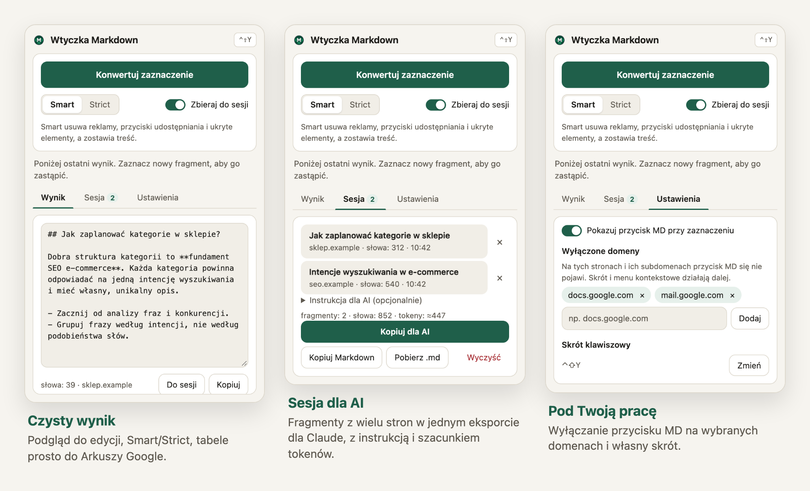

# Wtyczka Markdown



**Wtyczka Markdown** to rozszerzenie Chrome, które zamienia zaznaczony fragment strony na czysty Markdown i od razu kopiuje go do schowka. Zbiera też fragmenty z wielu stron w jedną sesję, gotową do wklejenia do Claude lub innego asystenta AI.

## Najważniejsze funkcje

- **Zaznacz → `MD` → wklej.** Przycisk `MD` pojawia się przy zaznaczeniu. Działa też skrót klawiszowy, menu kontekstowe i popup.
- **Czysty wynik.** Nagłówki, listy, linki, cytaty, tabele, kod, checklisty i `details` bez reklam, przycisków udostępniania i ukrytych elementów.
- **Dwa tryby czyszczenia.** Smart usuwa szum i zostawia treść. Strict dodatkowo wycina nawigację, stopki i boksy poboczne.
- **Tabela → Arkusze.** Kopiuje zaznaczoną tabelę jako TSV, więc wkleja się do Google Sheets lub Excela od razu w komórki.
- **Sesja dla AI.** Tryb „Zbieraj do sesji” odkłada kolejne fragmenty. Przycisk „Kopiuj dla AI” składa je w bloki `<document>` pogrupowane według źródeł, z własną instrukcją na końcu i szacunkiem tokenów. Sesję można też skopiować jako Markdown albo pobrać jako plik `.md`.
- **Licznik na ikonie.** Liczba zebranych fragmentów widoczna na ikonie rozszerzenia.
- **Wyłączanie na domenach.** Przycisk `MD` można ukryć na wybranych stronach, np. w panelach CMS albo poczcie.
- **Ramki i pola tekstowe.** Działa w `iframe` i w zaznaczeniu wewnątrz `textarea`.
- **Polski i angielski.** Interfejs dopasowuje się do języka przeglądarki.
- **Lokalnie i prywatnie.** Nic nie opuszcza przeglądarki.

## Jak zacząć

1. Zaznacz fragment tekstu na stronie.
2. Kliknij `MD` przy zaznaczeniu albo naciśnij `Ctrl+Shift+Y` (`Control+Shift+Y` na macOS).
3. Wklej wynik tam, gdzie potrzebujesz.

Chcesz zebrać materiał z kilku stron? W popupie włącz **Zbieraj do sesji**, zaznaczaj kolejne fragmenty, a na koniec otwórz kartę **Sesja** i kliknij **Kopiuj dla AI**.

Skrót zmienisz w popupie: **Ustawienia → Skrót → Zmień**.

## Jak wygląda



## Instalacja

1. Pobierz paczkę ZIP z zakładki [Releases](https://github.com/seoczek/wtyczka-markdown/releases) albo sklonuj repozytorium.
2. Otwórz `chrome://extensions` i włącz **Tryb dewelopera**.
3. Kliknij **Załaduj rozpakowane** i wskaż folder rozszerzenia.

Działa w Chrome 116+ i przeglądarkach na Chromium (Edge, Brave, Opera, Vivaldi, Arc). Na plikach lokalnych (`file://`) włącz w szczegółach rozszerzenia **Zezwalaj na dostęp do adresów URL plików**.

Po instalacji lub aktualizacji przycisk `MD` działa od razu na otwartych kartach, bez odświeżania.

## Prywatność

- Konwersja odbywa się lokalnie. Rozszerzenie nie wysyła treści, adresów ani ustawień na żaden serwer.
- Sesja jest zapisywana w pamięci lokalnej Chrome, dopóki jej nie wyczyścisz.
- Schowek jest używany tylko po Twojej akcji.

## Uprawnienia

| Uprawnienie | Po co |
|---|---|
| `<all_urls>` | Przycisk `MD` przy zaznaczeniu na każdej stronie i konwersja w ramkach. |
| `scripting` | Silnik konwersji ładuje się dopiero po kliknięciu, więc nie spowalnia stron. |
| `offscreen`, `clipboardWrite` | Niezawodne kopiowanie do schowka ze skrótu i menu kontekstowego. |
| `contextMenus` | Pozycja „Konwertuj zaznaczenie na Markdown” w menu po zaznaczeniu. |
| `storage` | Ustawienia, sesja i ostatni wynik. |

Chrome nie pozwala rozszerzeniom działać na stronach systemowych (`chrome://`), w Chrome Web Store i w przeglądarce PDF. Wtyczka sygnalizuje to wtedy czerwonym „!” na ikonie (a w popupie komunikatem), zamiast milczeć.

## Development

Wymagania: Node.js 20+ i npm.

```bash
npm install
npm run verify
```

| Skrypt | Co robi |
|---|---|
| `npm run lint` | ESLint oraz spójność manifestu, plików i tłumaczeń. |
| `npm test` | Testy silnika konwersji i warstwy rozszerzenia (Vitest + jsdom). |
| `npm run verify` | Lint, testy i `npm audit`. |
| `npm run test:e2e` | Testy w prawdziwym Chromium z załadowanym rozszerzeniem (Playwright). |
| `npm run pack` | Paczka `dist/wtyczka-markdown-<wersja>.zip` gotowa do Chrome Web Store. |

Do testów ręcznych służy `test-page.html` z typowymi przypadkami: szum CMS, tabele, ramka `iframe`, pole tekstowe.

## License

MIT. Szczegóły w pliku `LICENSE`.
